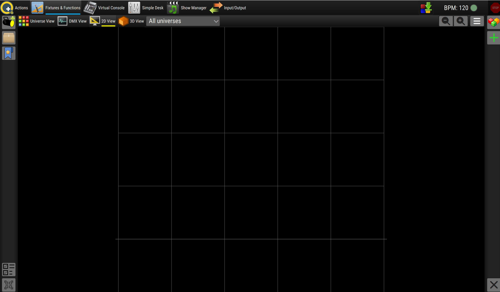

# QLC+ beginner's guide

A from-zero walkthrough to driving NocturNation from QLC+, written for someone who has never opened a lighting console before. By the end you will be able to install QLC+, navigate its interface, define the core concepts in plain English, plug a StickC into your laptop, build a Scene, sequence a Chaser, and link a cue stack to a track for a coordinated live performance.

This guide is split across thirteen sections. The first four are concept-only - install QLC+, learn the UI, learn the vocabulary. No NocturNation hardware required for sections 1-4. Section 5 introduces the cable; section 7 is the first-light moment where a slider in QLC+ produces a visible Lume flash.

If you already know QLC+ and want the short version of "where do I point my console?", read [`dmx-quickstart.md`](dmx-quickstart.md) instead.

## Table of contents

- [1. What QLC+ is and why we're using it](#1-what-qlc-is-and-why-were-using-it)
- [2. Install QLC+](#2-install-qlc)
- [3. The four panels](#3-the-four-panels)
- [4. Core concepts](#4-core-concepts)
- [5. Hardware](#5-hardware)
- [6. Configuring QLC+ output](#6-configuring-qlc-output)
- [7. First light](#7-first-light)
- [8. Building a Scene](#8-building-a-scene)
- [9. Building a Chaser](#9-building-a-chaser)
- [10. Linking a track](#10-linking-a-track)
- [11. Saving + sharing](#11-saving--sharing)
- [12. Glossary](#12-glossary)
- [13. Further reading](#13-further-reading)

---

## 1. What QLC+ is and why we're using it

**QLC+** (Q Light Controller Plus) is an open-source lighting console. It is the software a working lighting designer reaches for when they sit down to programme a show - the cross-platform, Qt-based equivalent of consoles like ETC Eos, MA Lighting grandMA, or Avolites. Where those cost five to fifty thousand pounds, QLC+ is free.

QLC+ has been in active development since 2004 and is used across hackerspaces, art events, small venues, theatre training programmes, and a growing number of working professional rigs. It speaks the same wire protocols (DMX-512, Art-Net, sACN, MIDI, OSC) as the commercial consoles, so a show built in QLC+ ports cleanly to a venue that uses grandMA on the night.

**Why are we using it for NocturNation?**

The architecture spec is explicit on this: NocturNation is a fixture, not a lighting designer. In autonomous mode (the Show framework) the system runs its own decisions, which is the right answer for hackspaces and home use. But the moment there *is* a real lighting designer in the room - at a venue, a touring show, an art installation programmed to a known track - the LD wants their own console driving the lights, not a black-box autonomous mode. QLC+ is the lingua franca that gets us there: any LD who can drive QLC+ can drive NocturNation, with no NocturNation-specific learning beyond a small fixture file.

The architecture spec calls this the "DMX-driven" mode in §1.2 *Implications for the DMX direction*. This guide is your way into it.

**The mental model.** QLC+ generates a stream of DMX values (numbers between 0 and 255, on numbered channels) and sends them down a wire to NocturNation. The StickC reads those channels, decides what each value means (channel 1 = master intensity, channel 2 = strobe rate, channels 3-5 = pulse RGB, etc.), and broadcasts NocturNation events to the bracelets and Tildagons. From the LD's point of view, NocturNation is a fixture with twelve channels per Lume group - exactly the same shape as a generic RGB par-can or wash light in any other console session.

---

## 2. Install QLC+

> **Status:** Use the official build from [qlcplus.org/downloads.html](https://www.qlcplus.org/downloads.html) (macOS `.dmg`, Windows installer, or Linux package), current stable (4.13.x as of mid-2026). Package-manager installs (Homebrew, apt, etc.) work fine but are a step removed from what the QLC+ project ships and tests.

1. **Download.** Visit [https://www.qlcplus.org/downloads.html](https://www.qlcplus.org/downloads.html), choose the build for your platform and the current stable release, and let it complete. 

2. **Run the installer or open the .dmg.** 

4. **First launch and first run.** QLC+ opens with an empty workspace. There may be a one-time dialog asking which output plugin to enable, or offering to load an example - for now, dismiss anything that pops up. You should end up at the main workspace with several panel-selector buttons (we'll meet them in section 3).

   

You're installed. **Verify by trying to quit and relaunch** - the second launch should be one double-click.

---

## 3. The four panels

QLC+ presents its interface as a small set of mode panels. Different versions of QLC+ label and arrange them slightly differently, but every modern release exposes the same four primary modes via toolbar buttons (usually along the top of the window). They are:

| Panel | What it is for | Beginner attention |
|-------|----------------|---------------------|
| **Fixtures** | Define the rig - what's connected, where it lives, and how it's addressed. | Start here. Every show begins by telling QLC+ what's in the room. |
| **Functions** | Define behaviour - the library of Scenes, Chasers, Audio, Shows. | Spend most of your programming time here. |
| **Virtual Console** | Build a custom performance UI - sliders, buttons, cue lists you'll trigger live. | Optional but powerful. Defer until you have a Scene to control. |
| **Simple Desk** | A built-in per-channel slider board. Always available; useful for testing. | Reach for this when you want to slam a channel value and see what happens. |

You select between them via the toolbar buttons (in some versions they're tabs along the bottom or icons along the top - same idea either way).

<!-- Screenshot: the QLC+ main window with the four panel-selector buttons annotated. Open QLC+, click each panel in turn, and replace this comment with a single annotated screenshot or one screenshot per panel. -->

A short tour of each - what to look at, what to ignore for now.

### Fixtures

This is where you build your virtual rig. The left pane lists the fixtures you've added; the right pane shows the channel layout for the selected fixture. New installs have nothing here yet. When we add the NocturNation fixture in section 6, this is where it lands.

Also in this panel you'll find universe management (NocturNation only needs one universe for the EMF demo) and the input/output configuration that connects QLC+ to whatever is on the other end of the wire.

### Functions

The library of behaviours QLC+ can produce. The left side lists folders (Scenes, Chasers, Audio, Shows, etc.); the right side opens the editor for whichever function you've selected. You'll build everything here: a static "all-red wash" Scene, a Chaser that cycles through palette colours, a Show that maps cues onto a recorded track's timeline.

### Virtual Console

A blank canvas where you drag in widgets - sliders, buttons, XY pads, cue list windows - and wire them to Functions. The point: a performance-night UI you operate without thinking about the underlying channel structure. For our first cue-stack-against-a-track exercise you can ignore this entirely; the Show timeline editor in Functions will drive playback.

### Simple Desk

Per-channel sliders for the active universe. Drag a slider, that channel's value changes immediately. The fastest way to test "is anything happening at all" - when you first connect a fixture, Simple Desk is where you verify it responds before you bother programming anything in Functions.

**The beginner's path through the panels:** Fixtures (add the NocturNation fixture) → Simple Desk (test it responds to a slider) → Functions (build a Scene, then a Chaser, then a Show) → Virtual Console (optional; only if you want a custom live UI). The next sections follow exactly that order.

---

## 4. Core concepts

DMX has its own vocabulary that's worth getting right before we touch the rest of the tool. Read this section twice if you need to - it's only six terms, but they reappear constantly.

### Universe

A numbered group of **512 channels**. One DMX cable historically carried one universe. QLC+ supports multiple universes side-by-side, routed to different outputs.

For NocturNation, the village-talk demo uses **one universe** routed over the USB-C cable to a single StickC. You don't need more.

*When you reach for this:* once, when you first set up your project. After that, leave it alone.

### Channel

One of the 512 lines inside a universe. Each channel carries an 8-bit value - a single number between **0 and 255**. That's the only data DMX transmits: 512 numbers per refresh, sent again and again about 30-44 times per second.

What a channel "means" is defined by the fixture occupying that channel address. Channel 1 is just "channel 1" until you tell QLC+ "channel 1 is the master intensity of my NocturNation fixture".

*When you reach for this:* in Simple Desk for testing. Otherwise, never directly - your fixtures define names that map to channels for you.

### Fixture

A logical device that occupies **N consecutive channels** starting at a base address. The fixture file (a `.qxf` file in QLC+'s case) tells QLC+ "this device has 12 channels - channel 1 is Master Intensity, channel 2 is Strobe Rate, channels 3-5 are Pulse R/G/B, …". Once added, you address the fixture by its meaningful names instead of channel numbers.

The NocturNation fixture is **12 channels per Lume group**. We'll add it to QLC+ in section 6.

*When you reach for this:* whenever you add or move hardware. One fixture per Lume group in NocturNation's case.

### Scene

A **saved set of channel values** - a single lighting state. "All NocturNation groups: blue at 50 % intensity, wash anchor B = cyan." Once saved, you can recall a Scene with a button, or fade smoothly to it over a chosen time. Scenes are the fundamental building blocks of any show.

*When you reach for this:* every static "look" in your show is a Scene. The verse look, the chorus look, the blackout - each one.

### Chaser

A **sequence of Scenes** with timings - "Scene A for 2 s → Scene B for 2 s → Scene C for 2 s → loop". Chasers are how you build repeating patterns like a colour wheel cycle, a beat-flash sequence, or a build-up.

*When you reach for this:* any repeating motion that's bigger than a single Scene. If you find yourself programming four near-identical Scenes that step through colours, that's a Chaser asking to be born.

### Show

A **timeline** - Scenes and Chasers placed at specific points in time, optionally synchronised to an audio file. This is the editor we'll use to programme a cue stack against a Coldplay track for the EMF village talk.

*When you reach for this:* whenever the lights need to follow recorded audio precisely. The Show editor's timeline view shows the waveform with cues laid against it.

### Cue List

A **numbered list of triggerable cues** - press the **Go** button, advance to cue N+1. The performance interface. Less relevant for our first track-driven show (the Show editor handles playback), but the way most live theatre and concert programming works.

*When you reach for this:* live shows where an operator presses Go in response to what's happening on stage. Optional for the village-talk demo.

### How these connect

A typical flow:

```
Channel  →  Fixture  →  Scene  →  Chaser / Show  →  Cue List
(raw)       (named)     (look)    (sequence)        (live trigger)
```

You set up the rig (Fixtures), define looks (Scenes), assemble them into motion (Chasers) or against time (Shows), and trigger them live (Cue Lists or Virtual Console buttons). For the EMF demo we'll go: Fixtures → Scenes → Show. No Chasers, no Cue List. Minimal viable performance.

---

## 5. Hardware

> **Kit list.** Laptop with QLC+ installed (sections 1-2). One StickC. One USB-C cable that carries data (most do, but some "charge-only" cables don't - if in doubt, use the one that came with the Stick or a known-good USB-C data cable). **No DMX dongle.**

The kit list is unusually short because of how NocturNation's DMX path works. In a traditional rig:

```
laptop  →  USB-DMX dongle  →  XLR-3 or RJ45 cable  →  DMX fixtures
                              (RS-485 wire)            (each speaks DMX-512)
```

In NocturNation's DMX path:

```
laptop  →  USB-C cable  →  StickC
                            (the Stick is the receiver; it speaks
                             the same Enttec Pro framing over USB-CDC
                             that a dongle would translate onto RS-485)
```

The StickC takes the role the dongle + first fixture would normally fill. There's nothing else to buy. This is a property of the architecture, not a workaround.

### Plug in the Stick

Plug the StickC into the laptop via USB-C. The Stick boots normally - you don't need to put it in any special mode. The USB-CDC peripheral comes up alongside the application firmware and the laptop's operating system enumerates the Stick as a serial port.

### Find the serial port

QLC+ in section 6 will need the name of that serial port. The name differs by operating system:

**macOS.** Open Terminal and run:

```sh
ls /dev/cu.usbmodem*
```

You should see one entry, something like `/dev/cu.usbmodem14101` or similar. The exact suffix varies per Mac and per USB port - what matters is that you see *exactly one* entry once the Stick is plugged in, and *no* entries when it's unplugged. If you see zero entries with the Stick plugged in, jump to "Driver troubleshooting" below.

**Linux.** Run:

```sh
ls /dev/ttyACM* /dev/ttyUSB* 2>/dev/null
```

You should see one entry, typically `/dev/ttyACM0` (the modern CDC-ACM kernel driver) or `/dev/ttyUSB0` (older USB-serial bridges). Either is fine - note which one and use it in section 6.

**Windows.** Open Device Manager (Start → type `Device Manager`), expand **Ports (COM & LPT)**. You should see an entry like `USB Serial Device (COM3)` or `Silicon Labs CP210x USB to UART Bridge (COM3)`. The `COMx` number is what QLC+ needs.

<!-- Verify-and-screenshot: capture what shows up on your machine when the Stick is plugged in. macOS users: paste the `ls` output. Linux users: same. Windows users: a Device Manager screenshot is more useful than text. -->

### Driver troubleshooting

In most cases the operating system auto-detects the StickC. If your platform doesn't:

- **macOS 10.13+ and current macOS.** Built-in support for CDC-ACM devices; no driver download needed. If the port doesn't appear, try a different USB-C cable (charge-only cables are the most common culprit) and a different USB port.
- **Linux.** The `cdc_acm` kernel module ships with every distro; loaded automatically on plug-in. `dmesg | tail` after plugging the Stick in should show the enumeration. If the device is recognised but `/dev/ttyACM0` isn't readable, your user may need to be in the `dialout` group: `sudo usermod -aG dialout $USER` then log out and back in.
- **Windows.** Some Stick variants enumerate as native USB-CDC (no driver needed on Windows 10+); others use a Silicon Labs CP210x USB-to-UART chip which needs the CP210x VCP driver from [silabs.com](https://www.silabs.com/developers/usb-to-uart-bridge-vcp-drivers). Install the driver, replug the Stick.

<!-- Verify-against-install: which of these applied to your machine? If macOS auto-detected with no fuss, that's the canonical happy path; everything else is troubleshooting noise the reader only needs if they hit it. -->

### Confirm the port is alive

Optional but useful sanity check: read the Stick's serial output to confirm the port is the Stick and not some other USB-serial device that happens to be plugged in.

**macOS / Linux:**

```sh
cat /dev/cu.usbmodem14101    # macOS - use your actual port name
# or
cat /dev/ttyACM0             # Linux
```

You should see Stick boot output and any debug messages the firmware prints. Press `Ctrl-C` to stop. Don't leave this terminal open when you move to QLC+ in section 6 - the serial port can only have one consumer at a time, and you want QLC+ to be the one.

---

## 6. Configuring QLC+ output

> **Heads-up on scope.** Section 6 is *preparation*. After completing it, QLC+ will be configured to point its DMX output at the StickC's serial port, but no light will yet change colour. The first-light moment - where a slider in QLC+ produces a visible Lume flash - is **section 7**, and section 7 depends on Epic 7 firmware blocks B1-B3 landing on the StickC. Until those ship, finish section 6's clicks anyway so the workflow is rehearsed and the configuration is saved.

### Open the Inputs/Outputs panel

In QLC+, open the **Inputs/Outputs** panel. The exact route varies by version:

- Some versions expose it as a button on the main toolbar alongside Fixtures / Functions / Virtual Console / Simple Desk.
- Others put it under **Tools → Plugin Manager** or **Inputs/Outputs** in the application menu bar.
- In recent versions there's also a dedicated **Universes** tab inside the Fixtures panel that shows the same configuration in a different layout.

<!-- Verify-against-install: which route does QLC+ 4.13.x take on your machine? Pick the one that worked and rewrite this section to lead with it; the other routes can become a single "(also reachable via …)" line. -->

You should land on a page with two main columns: **Universe** on the left (a row per universe; new installs have Universe 1 only) and **Output Plugin** alongside it.

<!-- Verify-and-screenshot: capture the Inputs/Outputs panel as QLC+ shows it on first open. -->

### Pick the Enttec DMX USB Pro plugin

Click the **Universe 1** row to select it. In the plugin column or the panel below, choose **Enttec DMX USB Pro** as the output plugin.

> If you don't see Enttec DMX USB Pro in the list, the plugin may be disabled. Check **Tools → Plugin Manager** (or equivalent) and confirm the Enttec plugin is enabled. Restart QLC+ if you toggle it.

<!-- Verify-against-install: confirm the plugin appears in the list. If QLC+ on macOS ships with the Enttec plugin built-in (it usually does), no extra install is needed. If your install is missing it, that's the bigger find - document the install path for it. -->

### Point the plugin at the Stick's serial port

With Enttec DMX USB Pro selected, there should be a **Configure** button (or similar) that opens the plugin's settings. Inside:

- Find the **Serial port** dropdown (or text field).
- Choose the port you identified in section 5:
  - macOS: `/dev/cu.usbmodem14101` (your number will differ)
  - Linux: `/dev/ttyACM0` or `/dev/ttyUSB0`
  - Windows: `COM3` (your number will differ)
- Save / OK to close the plugin config.

<!-- Verify-and-screenshot: the plugin's Configure dialog with the serial port selected. -->

### Address the universe

Back on the Inputs/Outputs panel, the Universe 1 row should now show the Enttec plugin assigned, with the Stick's serial port as the output. That means: any DMX values QLC+ generates for Universe 1 channels 1-512 will be packed into Enttec Pro frames and written down the cable to the Stick.

In a normal DMX rig you'd also set a *base address* on each fixture (channel 1 vs channel 13 vs channel 25, etc.) to slot multiple fixtures into one universe. NocturNation's fixture lands in section 8 once the `.qxf` ships; for now the universe is configured but empty.

### What QLC+ will look like

After section 6, QLC+ should show:

- **Inputs/Outputs panel:** Universe 1 mapped to "Enttec DMX USB Pro - `<your serial port>`".
- **No errors** at the top of the QLC+ window. Some versions of the Enttec plugin do a handshake (send a "Get Widget Serial Number" command, expect a response) at startup. Until Epic 7 firmware lands on the Stick, the Stick won't respond to that handshake and QLC+ may show "device not responding" or "widget not identified" in the plugin's status line. **That is expected at this point** - the configuration is correct; the Stick just doesn't speak Enttec Pro back yet. Section 7 closes that loop.

### Save the workspace

File → Save Workspace. Pick a name like `nocturnation-test.qxw` and save it somewhere you'll find again. Reopening QLC+ and loading this workspace gets you back to this state without redoing the clicks.

---

## 7. First light

This is the validation moment - the first time a slider you drag in QLC+ produces a visible response on a Lume. If section 6 was preparation, section 7 is the closing-the-loop. Once first light works, every other section in this guide is layering on top of a system that's already alive.

> **Pre-flight checklist:**
>
> - Sections 1-6 done (QLC+ installed, output configured, Stick recognised).
> - The Stick is plugged into the laptop and showing the boot screen.
> - At least one Lume is on the same ESP-NOW channel as the Stick will be - a second StickC running Lume mode, a Tildagon running Lume mode, or a PixMob bracelet within IR range of the Stick.
> - QLC+ is open and the workspace from section 6 is loaded.

### Step 1: enter DMX Bridge mode on the Stick

The Stick boots into the Menu. Cycle with Btn2 (the side button) until "DMX Bridge" is highlighted, then press Btn1 (the top button) to select.

The Stick's LCD switches to the DMX Bridge screen:

- A header reading either **"ACTIVE"** (green) when QLC+ is sending frames, or **"IDLE"** (red) when nothing has arrived recently.
- `age: ... ms` - milliseconds since the last frame.
- `f: ... b: ...` - total frames received and total bytes read since mode entry.
- A footer hint reminding you that a long-press on Btn2 exits back to Menu.

<!-- Verify-and-screenshot: capture the Stick's LCD when DmxBridge mode first opens and QLC+ is connected but idle. Header should read "IDLE" with all counters at 0. -->

If the header stays "IDLE" indefinitely after this point, jump to *Troubleshooting* at the bottom of this section.

### Step 2: open Simple Desk in QLC+

We're going to skip fixtures for now and drive raw channel values. Sections 8 onwards graduate to fixture-named workflows; for first light, raw channels are the most direct path.

Click the **Simple Desk** panel in QLC+. You should see a horizontal strip of channel sliders, one per DMX channel, numbered along the top. All start at 0.

<!-- Verify-and-screenshot: Simple Desk with a row of zeroed channel sliders. -->

### Step 3: light a Lume

NocturNation's 12-channel fixture layout (Epic 7 B0):

| Channel | Field |
|--------:|-------|
| 1 | Master intensity |
| 2 | Strobe rate |
| 3 | Pulse R |
| 4 | Pulse G |
| 5 | Pulse B |
| 6 | Pulse trigger |
| 7 | Wash anchor A R |
| 8 | Wash anchor A G |
| 9 | Wash anchor A B |
| 10 | Wash anchor B R |
| 11 | Wash anchor B G |
| 12 | Wash anchor B B |

The plan: set wash anchor A to a colour, then raise the master to make it visible.

1. **Drag channel 7 (Wash A R) to 255.** Nothing visible yet - the master is still 0, which scales the wash brightness to nothing.
2. **Drag channel 1 (Master intensity) to 255.** The Lume should light up red. The Stick's LCD header should flip to **"ACTIVE"** (green) and the `f` / `b` counters should be incrementing as QLC+ pumps frames.
3. **Drag channel 8 (Wash A G) up.** The Lume's red shifts toward orange / yellow as green is added.
4. **Drag channel 1 (Master) back to 0.** The Lume fades to black again. Nothing about the wash colour was lost - master is a pure brightness scalar.

**Congratulations - this is first light.** Every section onwards is making this richer, not different in kind.

<!-- Verify-and-screenshot: a Lume responding to a slider drag on Simple Desk. Phone camera + the bracelet / Tildagon ring lit up; QLC+ window in the background. -->

### Step 4: fire a pulse

Wash anchors hold a continuous baseline. The pulse channels fire transient flashes on top.

1. **Drag channels 3 / 4 / 5 (Pulse RGB) to 255 / 255 / 255** - white pulse colour.
2. **Drag channel 6 (Pulse trigger) up to 200 then back down.** On the way up - the moment it crosses 128 - one pulse fires. The trigger is rising-edge: held at 200 it won't refire. Drop back below 128 to re-arm; raise again to fire another pulse.
3. **Notice the firmware-side debouncing.** Wiggling the trigger slider rapidly only fires when the value crosses the 128 threshold from below.

### Step 5: continuous strobe

Channel 2 is a built-in strobe-rate generator independent of the trigger channel.

1. **Drag channel 2 to 64.** Pulses fire at ~1 Hz. (The mapping is linear: 255 = 4 Hz, the architecture-spec safety floor.)
2. **Drag channel 2 to 255.** Pulses at 4 Hz - the maximum.
3. **Drag back to 0** to stop the strobe.

Strobe and the manual trigger are independent: you can have a 1 Hz auto-strobe AND fire manual triggers on top of it from channel 6.

### Step 6: exit cleanly

Long-press Btn2 on the Stick to return to Menu. The mode emits a 1 s release fade on the way out so the Lumes go to black smoothly rather than snapping off. The Stick restores its console at 115 200 baud, so any developer-side debug output works again.

### Troubleshooting

If the Stick stays "IDLE" or the Lume doesn't respond:

**Check Stick → laptop wire path:**
- Does `ls /dev/cu.usbmodem*` (macOS / Linux equivalent) still show the Stick's port?
- Does QLC+'s Inputs/Outputs panel still show the Enttec plugin pointed at that port? (Switching mode sometimes resets the binding; re-check.)
- Is anything else (terminal, screen, IDE serial monitor) holding the port open? Close it.

**Check QLC+ output is actually emitting:**
- Drag a non-zero value on a slider you haven't touched. Does Simple Desk give visual feedback at the slider itself?
- Some QLC+ versions need the workspace to be in "Operate Mode" (not "Design Mode") for Simple Desk to drive output. Toggle if needed.

**Check Stick is in DMX Bridge mode:**
- The LCD must show the DMX Bridge screen, not the Menu, not Director, not anything else.
- If `f` / `b` stays at 0 after a slider drag, the Stick isn't seeing bytes.

**Check Lume reachability:**
- Is the Lume on the same ESP-NOW channel as the Stick? (Default is channel 1 for the hobby band; verify in the Lume's own Config menu.)
- Is the Lume in the right `target_group` for the broadcast? For v1 the DMX Bridge fires to "00:00" which is every-class-every-group, so any Lume should respond. If your Lume has a group filter set, clear it.
- Is the Lume's binding actually rendering? Try Director mode briefly to confirm the Lume is responsive at all.

---

## 8. Building a Scene

Simple Desk is great for testing. For a real show, you want **saved looks** you can recall at any moment - that's what a Scene is. A Scene is a snapshot of channel values; recalling it sends those values to the Lumes, optionally fading from wherever the previous state was.

### Step 1: open Functions

Click the **Functions** panel. The left side lists folders ("Scenes", "Chasers", "Audio", "Shows", etc.); the right side opens the editor for whatever you select.

<!-- Verify-and-screenshot: Functions panel with an empty Scenes folder. -->

### Step 2: create a new Scene

Right-click in the Scenes folder (or use the toolbar / + button - the exact gesture varies by QLC+ version) and choose "New Scene". A new untitled Scene appears with an editor on the right.

### Step 3: name + populate

In the Scene editor:

1. **Rename the Scene** to something meaningful - "Verse" for our first one.
2. **Pick the channels** the Scene should set. The editor exposes the channels of the active universe; tick the ones you want this Scene to touch. **Channels you don't tick are left at their last value** when the Scene is recalled - so a Scene that only sets the wash anchors keeps any operator-driven master / pulse values intact.
3. **Set values** on the ticked channels:
   - Channel 1 (Master): 200 (medium-bright)
   - Channels 7-9 (Wash A R/G/B): 120 / 30 / 0 - a warm orange. Matches the Bass & Drift Verse palette anchor A.
   - Channels 10-12 (Wash B R/G/B): 60 / 10 / 0 - the corresponding dim red anchor B.

Save the Scene (Ctrl-S or the toolbar Save button).

### Step 4: recall the Scene

How you trigger a Scene varies by panel:

- From the Functions panel, double-click the Scene name (some versions) or right-click → "Run".
- From Virtual Console (see section 9), drop a Button widget and bind it to this Scene.
- From a Show timeline (section 10), drag the Scene onto the timeline at a moment in time.

Either way, the Lumes should switch to your "Verse" colour.

### Step 5: add a contrast Scene

Repeat steps 2-4 with a different colour set:

- **Name:** "Chorus"
- **Channel 1 (Master):** 255 (full brightness)
- **Channels 7-9:** 0 / 220 / 255 - cool cyan, matching the Cool palette in Bass & Drift's chorus.
- **Channels 10-12:** 200 / 0 / 220 - hot magenta anchor B.

Now you have two saved looks. You can recall either at any time. This is the building block for everything that follows.

### Fading between Scenes

QLC+ Scenes have a built-in fade-in / hold / fade-out time. Set them in the Scene's properties (look for "Fade In" / "Hold" / "Fade Out" fields).

- **Fade In:** how long it takes to interpolate from the current channel values to the Scene's values when recalled.
- **Hold:** how long the Scene stays at full intensity before fading out (only meaningful when chained in a Chaser, section 9).
- **Fade Out:** how long it takes to fade from the Scene's values back to wherever (0 by default, or the next Scene's values).

A 2-second Fade In on the Chorus Scene gives a soft ramp from Verse into Chorus instead of a hard snap. Try it.

---

## 9. Building a Chaser

A Chaser is **a sequence of Scenes** with timings - the simplest form of an automated cue stack. "Verse Scene for 4 seconds → Chorus Scene for 4 seconds → loop" is one line of programming.

### Step 1: create a new Chaser

In the Functions panel, create a new Chaser the same way you created a Scene (right-click in the Chasers folder → New Chaser).

### Step 2: add Scenes to the Chaser

The Chaser editor has a list of steps. For each step, choose:

- **Function:** the Scene to run. Pick "Verse" for step 1, "Chorus" for step 2.
- **Hold time:** how long to stay on that step before advancing.
- **Fade in time:** how long to fade from the previous step into this one (overrides each Scene's built-in fade).
- **Fade out time:** rarely needed; usually 0.

Click + to add a step, fill in the fields, repeat.

### Step 3: loop or one-shot?

Chasers have a "Run Order" setting:

- **Loop:** restart from step 1 after the last step.
- **PingPong:** play forward then backward.
- **SingleShot:** play once then stop.

For a verse / chorus cycle that runs continuously, pick Loop.

### Step 4: trigger the Chaser

Same options as a Scene: from Functions, from Virtual Console, from a Show timeline. Once started, the Chaser steps through the Scenes on its own.

### When to reach for a Chaser

- **Repeating colour cycles.** Three Scenes (Warm / Cool / Vivid) in a Loop Chaser = an automated palette walker.
- **Build-up sequences.** Six Scenes with gradually increasing master intensity in a SingleShot Chaser = a build into a chorus.
- **Stuck-on-mood backgrounds.** A long-hold Chaser cycling slowly through three closely-related Scenes = an ambient backdrop that breathes.

### What a Chaser isn't

A Chaser is **time-driven**. It doesn't know about your audio track. If you want the cues to land on specific moments in a recorded song, that's section 10's territory - the Show timeline.

---

## 10. Linking a track

The Show timeline is where QLC+ stops being a slider board and starts being a lighting console. Drop an audio file in, drop Scenes and Chasers along the waveform, hit play - the lighting follows the music.

This is the workflow the EMF village-talk demo uses.

### Step 1: create a Show

In the Functions panel, create a new Show (the same flow as a Scene or Chaser - look for the Shows folder).

The Show editor opens with a timeline view. Along the top is a transport (play / pause / stop / scrub). The body of the editor is a waveform area where audio will be laid out, with tracks underneath for placing Scenes / Chasers along the time axis.

<!-- Verify-and-screenshot: empty Show timeline editor. -->

### Step 2: load an audio file

In the Show editor, find the "Add audio" function (a button in the toolbar, or right-click → Add Audio). Pick a track file from your laptop - WAV, MP3, FLAC all work in modern QLC+.

The waveform should render along the timeline. Scrubbing the playhead plays the audio.

### Step 3: place a Scene against the music

Listen to the track. When you hear a section change (chorus arrives, drop hits, breakdown starts), note the timestamp.

In the Show editor, drag a Scene from the Functions palette (or use the Add menu) onto the timeline at that timestamp. The Scene snaps to a track row at the time you placed it.

Repeat for each section change you want to mark:

- Verse → Chorus transition: drop the "Chorus" Scene at the chorus timestamp.
- Chorus → Drop transition: drop a Drop Scene at the drop timestamp.
- Drop → Breakdown: drop a Breakdown Scene.
- Repeat for each subsequent section.

A 4-minute song with 8-12 well-placed Scenes feels surprisingly composed.

### Step 4: place a Chaser for a section

Where you want continuous motion (e.g. a build-up's pulsing red), drop a Chaser on the timeline instead of a Scene. The Chaser starts at its placed time and runs until the next item on the same track.

### Step 5: play through

Hit play. The audio plays; as the playhead crosses each Scene / Chaser marker, that lighting cue fires. The Lumes follow the song.

Scrub the playhead to skip around - useful when iterating on a particular section's lighting.

### Tuning tips

- **Use fade-in times to smooth transitions.** A 1-2 second fade-in on a Chorus Scene gives a soft visual rise rather than a hard step.
- **Place cues slightly before the audio moment, not after.** Light travels faster than sound (or rather, the audience expects the visual cue to arrive *with* the audio, not lagging behind). Adjust 50-100 ms early as needed.
- **The §1.2 design language applies.** Re-read the architecture spec's *Lighting design principles* before programming a serious show. The headline rules: restraint earns the moments that matter; bass-led not hi-hat-led; sections matter more than beats.

### Saving the Show

The Show is part of the workspace - **File → Save Workspace** persists it alongside your Scenes, Chasers, and channel mappings. The next time you open the workspace, the Show is there with all its cue placements intact.

---

## 11. Saving + sharing

QLC+ workspaces are single `.qxw` files - XML inside, but you never read them by hand. One file holds everything: universe config, fixtures, all Scenes / Chasers / Shows, and Virtual Console layout.

### Saving

**File → Save Workspace** (or Ctrl-S). The first save prompts for a path; subsequent saves overwrite the same file.

Recommended naming: `<event-name>-<track-name>.qxw`, e.g. `emf2026-sky-full-of-stars.qxw`. Workspace files are tied to specific tracks - one show per workspace keeps things tidy.

### Sharing

The `.qxw` file is portable across operating systems and QLC+ versions. Email it, drop it in a GitHub repo, push it to a USB stick - any way of moving a file works.

What recipients need to run it:

- QLC+ installed (any modern version; backward-compatible).
- A USB-DMX path - either a NocturNation Stick, a hardware DMX dongle, or any other Enttec Pro-compatible receiver.
- The audio file the show references, in the same path the workspace expects (or QLC+'s "missing audio" dialog lets you re-link).

### Backup

QLC+ doesn't auto-save. **Save often** when programming, especially before scrubbing through a long track (it's easy to lose track of unsaved changes). Keep a backup copy somewhere outside the working directory.

### For the EMF demo

The village-talk demo will ship its workspace file alongside the slide deck as part of the talk's materials. The closing live performance is just: load the workspace, plug in the Stick, hit play. No improvisation - that's the whole point.

---

## 12. Glossary

| Term | Meaning |
|------|---------|
| **ASR envelope** | Attack / Sustain / Release - the three-stage shape of a NocturNation pulse. QLC+ doesn't expose ASR directly; NocturNation's `LIGHT_PULSE` carries it via the wire. |
| **Chaser** | A QLC+ Function that plays Scenes in a timed sequence. See section 9. |
| **Channel** | One of the 512 lines in a DMX universe. Carries an 8-bit value. See section 4. |
| **Cue / Cue List** | A numbered list of triggerable lighting states. QLC+ exposes this via Virtual Console's Cue List widget. Less relevant for track-driven shows; standard for live performance. |
| **DMX-512** | The 1986 ESTA standard for lighting console-to-fixture communication. 512 channels per universe, 8 bits each, sent at 250 kbit/s over RS-485 (or, in NocturNation's case, 921 600 baud over USB-CDC with Enttec Pro framing). |
| **Enttec Pro framing** | The byte-format an Enttec DMX USB Pro dongle uses to carry DMX over USB-CDC. NocturNation's Stick implements this format directly. |
| **Fixture** | A logical lighting device occupying a contiguous range of DMX channels. The NocturNation fixture is 12 channels per Lume group. See section 4 + the channel layout in section 7. |
| **Lume** | A NocturNation receive-only device that renders lighting events (PixMob bracelet, Tildagon badge, second Stick in Lume mode). |
| **Master Intensity** | Channel 1 in the NocturNation fixture. Multiplies the wash + pulse output brightness. Set to 0 = blackout. |
| **Patch** | Lighting-design jargon for the mapping between fixtures and DMX channel addresses. QLC+'s Fixtures panel does the patch. |
| **Pulse** | A short flash (NocturNation's `LIGHT_PULSE` wire frame). Fired by the Pulse Trigger channel (rising edge) or by the strobe channel (continuous cadence). |
| **Scene** | A QLC+ Function that holds a snapshot of channel values. See section 8. |
| **Show** | A QLC+ Function that lays Scenes / Chasers against a timeline tied to an audio file. See section 10. |
| **Simple Desk** | A QLC+ panel with raw per-channel sliders. The fastest way to test that channels reach Lumes; the foundation everything else builds on. |
| **Strobe** | Continuous repeated flashing at a configured rate. NocturNation Channel 2 sets the rate; the architecture spec §15.1 caps it at 4 Hz for safety. |
| **Universe** | A group of 512 DMX channels addressed as a unit. NocturNation uses one universe per laptop. See section 4. |
| **Virtual Console** | A QLC+ panel for building a custom performance UI - buttons, sliders, cue list widgets you operate during a live show. Optional for track-driven shows. |
| **Wash** | A continuous baseline lighting state (NocturNation's `LIGHT_WASH` wire frame). The Wash A + Wash B anchors on channels 7-12 define the colour. |

---

## 13. Further reading

### QLC+ specifics

- **[QLC+ official documentation](https://docs.qlcplus.org/)** - reference for every panel, plugin, and Function type. Reach for it when the beginner's guide doesn't cover what you need.
- **[QLC+ GitHub repository](https://github.com/mcallegari/qlcplus)** - if you want to file a bug, contribute a fixture file, or follow what's coming next.
- **QLC+ forums** - active community; good first stop when something isn't working as documented.

### DMX + lighting standards

- **DMX-512 standard (ESTA E1.11)** - the wire format underneath everything in this guide. Worth reading once if you ever need to debug at the byte level.
- **sACN (E1.31)** - the modern Ethernet-based replacement for cable DMX. Not used by NocturNation v1 but the natural next step (planned for Epic 7 v2).
- **Open Lighting Project** - umbrella site covering DMX, Art-Net, sACN, OLA. The reference for "how do lighting consoles talk to each other".

### Lighting design

- **NocturNation architecture spec §1.2** *Lighting design principles* - **read this**. The "why" behind everything in this guide. Restraint earns the moments that matter; bass-led not hi-hat-led; the three timescales (song / phrase / beat) and which hook talks to which.
- **LD-at-Large podcast** (Lose, 2019-present) - working concert lighting designers talking about philosophy + craft. The Music-by-Sia "less-is-more principle" episode is particularly relevant.
- **Chauvet Professional's Lyrical Light interview series** - case studies with working LDs. Felix Peralta's musicality-led approach is the closest match to NocturNation's intent.
- **Pilbrow, F. (2017). *Performance Lighting Design: How to Light for the Stage, Concerts and Live Events.*** The standard reference textbook. Cue structure, lighting score notation, the LD-as-musician framing.

### NocturNation companion docs

- **[developing-shows.md](developing-shows.md)** - the cross-platform Show plug-in surface. Read this if you want to write autonomous-mode behaviour (the alternative to DMX-driven mode).
- **[architecture.md](architecture.md)** - the full system design. Sections §10 (operating modes) and §15 (safety) are most relevant if you're driving NocturNation from QLC+.

### Where to ask for help

- **NocturNation GitHub Discussions** - the place for QLC+ + NocturNation-specific questions.
- **QLC+ forums** - for pure QLC+ questions where NocturNation isn't the relevant variable.

You're done. Go programme a show.
